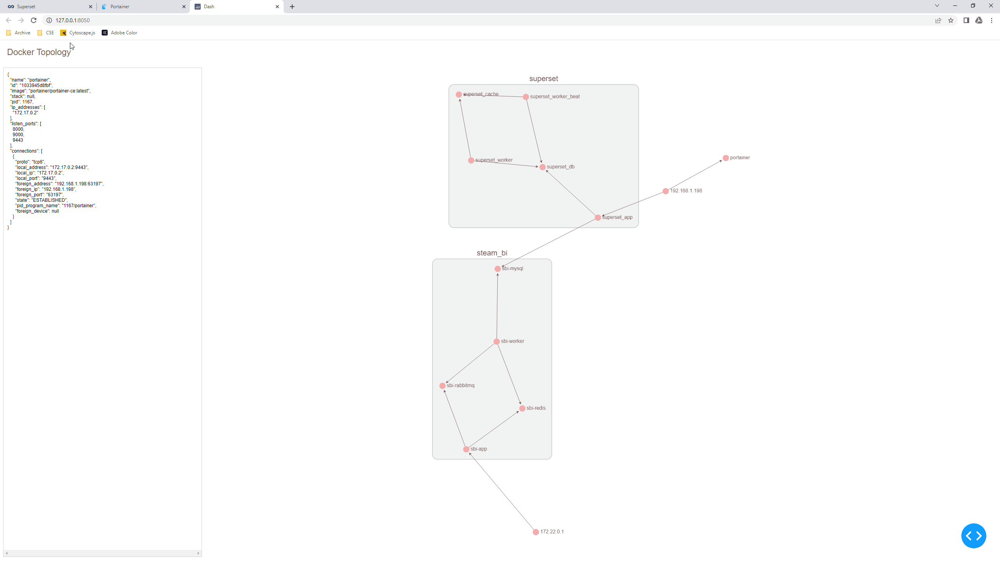

# docker-dash

Visualize network activity between Docker containers on a host. docker-dash collects TCP/UDP connections and container metadata using a combination of system tools and Docker APIs, storing collected data in MongoDB for interactive exploration through a dashboard built with Dash and Cytoscape.



---

## Project Requirements

- **Python 3.7+**
- **Docker Engine** installed and running
- **Docker Compose** (for simplified setup)
- **sudo/root access:** Required for running low-level networking commands inside containers
- **MongoDB:**  Required for persistent storage of collected container/connection data
- **Python dependencies:** See `requirements.txt`
  - dash_cytoscape==1.0.2
  - docker==7.1.0
  - pymongo==4.15.3

---

## Installation Procedure

1. **Clone the repository:**
   ```bash
   git clone https://github.com/m-e-w/docker-dash.git
   cd docker-dash
   ```

2. **(Recommended) Build and start via Docker Compose:**
   - Copy `docker-compose.yml.example` to `docker-compose.yml`
     ```bash
     cp docker-compose.yml.example docker-compose.yml
     ```
   - Start all services:
     ```bash
     docker compose up --build -d
     ```
   - This will launch both the dashboard app and a MongoDB instance, interconnected on the `docker_dash` network.

3. **Create the python virtual environment:**  
The command below will create a folder called `venvs` in the users home directory and will then create a new python virtual environment called `docker-dash` inside of it. 
     ```bash
     mkdir -p /home/$USER/venvs && python -m venv /home/$USER/venvs/docker-dash
     ```
4. **Activate the python virtual environment**  
     ```
     source /home/$USER/venvs/docker-dash/bin/activate
     ```
5. **Install the required python package dependencies**
     ```bash
     pip install -r requirements.txt
     ```

---

## How to Use

### 1. Collect and view network data

- **To generate a fresh snapshot of all Docker container connections:**
  ```bash
  sudo python dd.py
  ```
  - This will print a JSON snapshot of host and container connections.

- **To save a snapshot to MongoDB:**
  ```bash
  sudo python dd.py mongo
  ```
  - Requires local MongoDB running on default port.

### 2. Launch the Dashboard Application
  The dashboard will be available at [http://localhost:8050](http://localhost:8050) after running `docker compose up -d` 

### 3. Usage Notes

- **Snapshots**
  - Note: Only the last 100 snapshots are loaded by default. But you can override this and enter any # you want. Snapshots are loaded by most recent first. 

### 4. Local Development
  For local development purposes, you can also start the dash app in dev mode:  
  ```bash
  python app.py dev
  ```
  By default, it will listen on [http://localhost:8050](http://localhost:8050) 
    - You can edit app.py to listen on `0.0.0.0:8050` if needed for external access.
  
---

For troubleshooting, advanced configuration, or contributing, please see code comments or open an issue.
